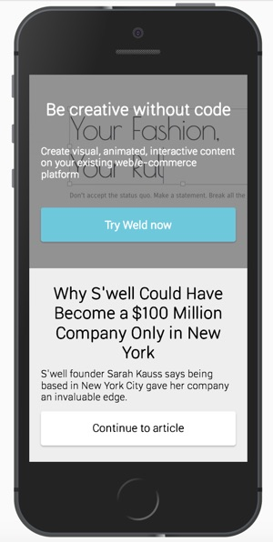

# Clicksite

Clicksite turns great articles on the web into content that drives traffic to _your_ website.

Made by the team at **Weld** ([www.weld.io](https://www.weld.io?utm_source=github-clicksite)), the #codefree app and web creation tool:

## How to Run

(Optional) Set API password:

	export API_PASSWORD=xxx

Start with:

	npm run dev # development mode

or

	npm start # production mode

Server will default to **http://localhost:3033**

## How to Test

	npm test

## Entities

* **Article**: link to external article.
* **Ad**: an ad banner to show.

## REST API

### Articles

List articles

	curl http://localhost:3033/api/articles?password=[API_PASSWORD]

Get a specific article

	curl http://localhost:3033/api/articles/[UPDATE_ID]?password=[API_PASSWORD]

Create new article:

	curl -X POST -H "Content-Type: application/json" http://localhost:3033/api/articles?password=[API_PASSWORD] -d '{ "url": "https://news.com/article-link" }'

Update an article:

	curl -X PUT -H "Content-Type: application/json" http://localhost:3033/api/articles/[UPDATE_ID]?password=[API_PASSWORD] -d '{}'

Delete article:

	curl -X DELETE http://localhost:3033/api/articles/[UPDATE_ID]?password=[API_PASSWORD]

Delete all articles:

	curl -X DELETE http://localhost:3033/api/articles?password=[API_PASSWORD]

## Deploying on Heroku

	heroku create MYAPPNAME
	heroku addons:create mongolab
	heroku config:set GOOGLE_ANALYTICS_ID=UA-xxx
	heroku config:set API_PASSWORD=xxx
	git push heroku master
